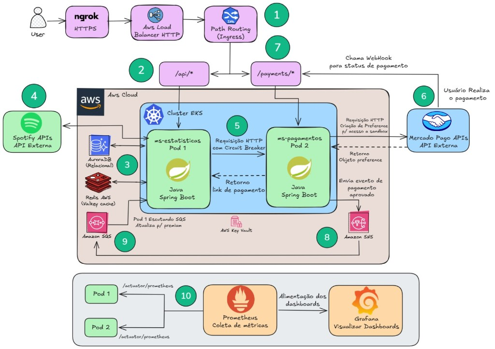
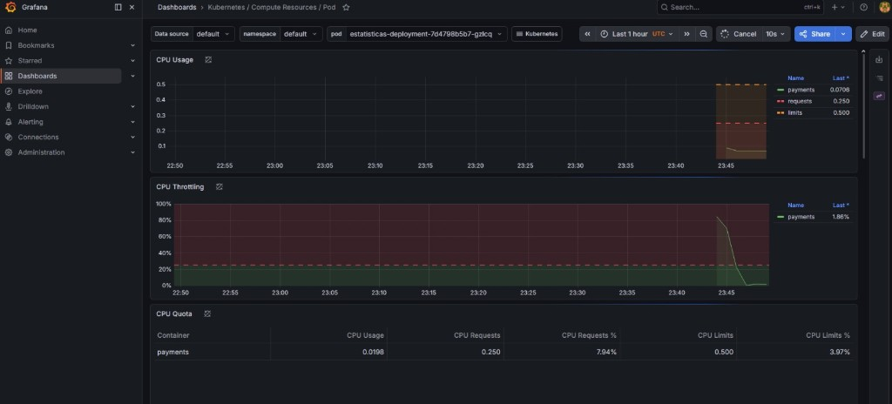

# Spotify Payments (ms-pagamentos)

Microsserviço de **pagamentos** do ecossistema Spotify Analytics: integração com o **Mercado Pago** para **geração de preferências (link de checkout)**, tratamento de **notificações/webhook** de pagamento e publicação de **eventos no Amazon SNS** para que o **ms-estatisticas** promova o usuário a **Premium** ao consumir a fila **SQS** (assinatura SNS → SQS). Arquitetura alinhada à execução em **Kubernetes (EKS)** na **AWS**, com **Ingress** (roteamento por prefixo), **Spring Boot Actuator** e métricas **Prometheus**.

## Microsserviços do projeto

A solução completa é composta por **dois microsserviços** em Spring Boot; a relação abaixo inverte a perspectiva deste repositório (**pagamentos**).

| # | Serviço | Repositório |
|---|---------|-------------|
| **1** | **ms-estatisticas** (API Spotify, estatísticas Free/Premium, consumo **SQS**, orquestração que chama este serviço) | [**spotify-analytics** no GitHub](https://github.com/ruaanls/spotify-analytics) *(ajuste o link se o nome do repositório for outro)* |
| **2** | **ms-pagamentos** (Mercado Pago, preferências, webhook, publicação **SNS**) | **Este repositório** |

---

## Visão geral

Este serviço concentra o **fluxo financeiro** com o Mercado Pago: cria **preferências de pagamento** (URL de redirecionamento ao checkout), expõe um endpoint de **callback** compatível com a **notification URL** configurada na preferência e, após validar o pagamento, monta um **evento de domínio** e o envia ao **tópico SNS** configurado. O **ms-estatisticas** permanece desacoplado: assina o tópico com uma **fila SQS** e processa mensagens no formato esperado (**envelope SNS** no payload), atualizando o perfil de forma assíncrona.

Fluxo resumido:

1. Cliente (via **ms-estatisticas** ou exposto no Ingress) solicita **checkout** → `POST /payments` com dados do pagador.
2. Usuário paga no Mercado Pago; o provedor chama o **webhook** → `POST /payments/callback`.
3. Serviço confirma o pagamento (SDK Mercado Pago), monta o evento e **publica no SNS** → entrega à **SQS** → consumo pelo **ms-estatisticas**.

---

## Principais funcionalidades

| Área | Descrição |
|------|-----------|
| **Checkout** | Criação de **preferência** Mercado Pago (`PreferenceClient`), retorno da URL (`init_point`) para o cliente. |
| **Webhook / callback** | Endpoint REST que recebe o corpo da notificação, consulta o pagamento e decide se há evento a publicar. |
| **Eventos (SNS)** | Publicação com `SnsTemplate` para o **ARN** configurado; mensagem com payload JSON do evento de pagamento confirmado. |
| **Integração com ms-estatisticas** | Contrato assíncrono **SNS → SQS**; o outro microsserviço consome a fila e aplica upgrade **Premium**. |
| **Configuração** | Parâmetros externos via **AWS Systems Manager Parameter Store** (`spring.config.import` opcional). |
| **Operação** | **Spring Boot Actuator** (health com probes) e métricas **Prometheus**. |

---

## Arquitetura

### Diagrama da solução (AWS / EKS)

Fluxo completo: acesso do usuário (ex.: **HTTPS** via **ngrok**) → **Load Balancer AWS** → **Ingress** com *path routing* (`/api/*` → **ms-estatisticas**, `/payments/*` → **ms-pagamentos**), integrações **Spotify** e **Mercado Pago**, **SNS/SQS**, **AuroraDB**, **Redis (Valkey)**, **Prometheus/Grafana** e gestão de segredos na nuvem AWS.



- **EKS**: orquestração dos dois microsserviços **Java Spring Boot** em *pods* distintos.
- **Ingress + LB**: exposição única; **path routing** encaminha tráfego por prefixo de URL para o serviço correto (incluindo o webhook Mercado Pago em **`/payments/*`**).
- **ms-estatisticas**: APIs Spotify, estatísticas, **AuroraDB**, **Redis**; chama o ms-pagamentos por **HTTP** com **circuit breaker**; consome **SQS** para promover **Premium** após confirmação assíncrona.
- **ms-pagamentos** *(este repositório)*: **Mercado Pago** (preferência / link de pagamento), **webhook** e publicação de eventos em **Amazon SNS**; a mensagem segue para **SQS** inscrita no tópico.
- **Observabilidade**: *scraping* de **`/actuator/prometheus`** nos *pods* → **Prometheus** → **Grafana**.

### Organização do código

Separação entre regras de aplicação e infraestrutura:

- **`application`** — casos de uso (`PremiumService`, `EventService`), DTOs, contratos de serviço (`*Impl` interfaces), exceções de aplicação.
- **`infra`** — **adaptadores**: REST (`PaymentController`), configuração AWS (`AwsConfig`), cliente Mercado Pago (`MercadoPagoClient`), handler global de erros.

*(Não há pacote `domain` explícito neste repositório; o núcleo está nos serviços de aplicação e DTOs.)*

### Mensageria com o ms-estatisticas

- **Este serviço** publica no **Amazon SNS** (`app.aws.sns.topic-arn`).
- A fila **SQS** do **ms-estatisticas** deve estar **inscrita** nesse tópico; o consumidor trata o formato de notificação SNS e atualiza o usuário.

---

## Vídeo demonstração

Demonstração da solução completa (dois microsserviços e integrações):

**[Assistir no YouTube](https://www.youtube.com/watch?v=sX6PGb-koeA)**

---

## Stack tecnológica

| Camada | Tecnologia |
|--------|------------|
| Runtime | **Java 17**, **Spring Boot 3.2** |
| API | **Spring Web MVC** |
| Pagamentos | **SDK Java Mercado Pago** (`com.mercadopago:sdk-java`) |
| Nuvem AWS | **Spring Cloud AWS 3.3** (**SNS**), **Parameter Store** |
| AWS SDK v2 | **BOM** 2.x (`auth`, `regions`, cliente **SNS** via starters/config) |
| Observabilidade | **Spring Boot Actuator**, **Micrometer Prometheus** |
| Build | **Gradle** |
| Boilerplate | **Lombok** |

---

## API REST (resumo)

Prefixo base do controller: **`/payments`**. Porta padrão local: **`9090`** (ver `application.yaml`).

| Método | Caminho | Descrição |
|--------|---------|-----------|
| `POST` | `/payments` | Cria preferência Mercado Pago; corpo com `CreateReferenceRequestDTO` (inclui `username` e dados do pagador). Resposta com URL de redirecionamento (`redirectUrl`). |
| `POST` | `/payments/callback` | Webhook/notificação; processa pagamento e, se aplicável, **publica evento no SNS** para o ms-estatisticas. |

Em produção, a **notification URL** da preferência deve apontar para a URL pública deste endpoint (ex.: Ingress `/payments/callback` ou túnel **ngrok** em desenvolvimento).

---

## Configuração

Propriedades relevantes em `src/main/resources/application.yaml` e/ou **Parameter Store**:

| Propriedade | Função |
|-------------|--------|
| `spring.config.import` | `optional:aws-parameterstore:/config/myapp/` — parâmetros centralizados na AWS. |
| `spring.application.name` | Nome da aplicação (ex.: `ms-pagamentos`). |
| `cloud.aws.region.static` | Região AWS (ex.: `sa-east-1`). |
| `app.aws.sns.topic-arn` | **ARN do tópico SNS** para publicação dos eventos de pagamento confirmado. |
| `spring.api.v1.mercadopago-access-token` | **Access token** Mercado Pago (via secrets/Parameter Store em produção). |
| `cloud.aws.credentials.*` | Credenciais AWS usadas na configuração de beans (ajuste conforme ambiente; preferir **IAM roles** no EKS). |
| `management.endpoints.web.exposure.include` | `health`, `prometheus` — probes e scraping. |

Variáveis sensíveis (token Mercado Pago, ARN do tópico, credenciais) devem vir de **Parameter Store**, **Secrets Manager** ou **secrets** do Kubernetes.

---

## Execução local (desenvolvimento)

Requisitos: **JDK 17**, **Gradle** (wrapper incluído), credenciais/config Mercado Pago e AWS conforme o ambiente.

```bash
./gradlew bootRun
```

Testes:

```bash
./gradlew test
```

---

## Observabilidade

- **Micrometer + registry Prometheus**: métricas HTTP e de JVM; compatível com dashboards no **Grafana**.
- **Actuator**: health com **liveness/readiness** (`management.endpoint.health.probes.enabled`) para orquestradores como o **Kubernetes**.

No **EKS**, o padrão usual é **ServiceMonitor** (ex.: `k8s/servicemonitor.yaml`) ou anotações de scrape, com **Grafana** usando *datasources* Prometheus apontando para o endpoint de métricas do cluster.

### Grafana em execução (evidência)

Dashboard **Kubernetes / Compute Resources / Pod** no Grafana: CPU (*requests* / *limits*), uso e *throttling*, com métricas vindas do **Prometheus** no cluster — visibilidade operacional da carga dos microsserviços.



---

## Autoria

Projeto por **Ruan Lima Silva** — [LinkedIn](https://www.linkedin.com/in/ruanls/)
